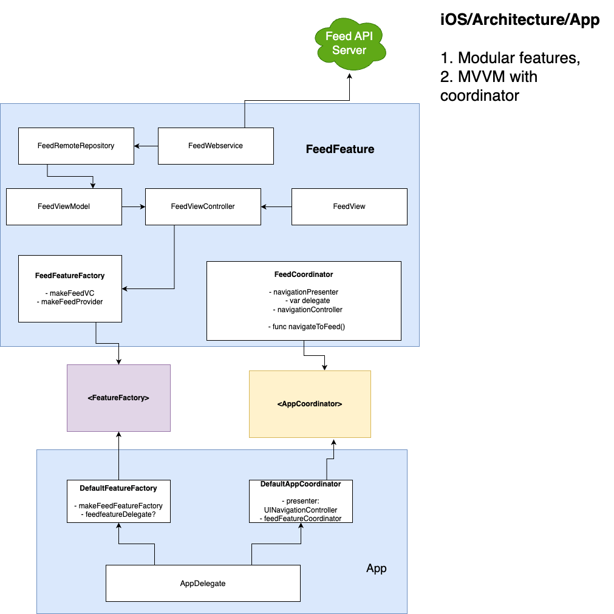

## FeedFeature

A clean stable starting point for building ios apps. 

Simple modular testable features/components. 
Stack - Factory, Coordinator, MVVM, Repository and Web service. 
Coordinator plugs into host app's SceneDelegate::willConnectTo with app injected navigation controller.

 

```swift
//
//  FeedFeature.swift
//  archapp
//
//  Created by Krishna Kumar on 1/11/23.
//

import UIKit

/// Feed Feature
/// JSON Placeholder client app

/// Interfaces
protocol FeedFeatureCoordinator {
    var navigationPresenter: NavigationPresentation { get }
    var delegate: FeedFeatureCoordinatorDelegate? { get set }
    var navigationController: UINavigationController? { get set }

    func navigateToFeed() -> ()
}

protocol FeedFeatureCoordinatorDelegate: AnyObject {}

protocol FeedWebService {
    func fetchPosts(queue: DispatchQueue, completion: @escaping ([Post]?, Error?) -> ()) -> ()
}

protocol FeedRemoteRepository {
    var webService: FeedWebService { get }
    func fetchPosts(queue: DispatchQueue, completion: @escaping (Result<[Post], Error>) -> ()) -> ()
}

protocol PostTableViewCellDelegate: AnyObject {}

protocol FeedViewModel {
    var repository: FeedRemoteRepository { get set }
    var posts: [Post] { get set }
    func fetchPosts(completion: @escaping (Result<[Post], Error>) -> ()) -> ()
}

/// Codables

struct Post: Decodable, Equatable {
    let id: Int
    let title: String
    let body: String
}

/// Errors

enum WebServiceError: Error {
    case invalidURL
    case noData
}

enum RepositoryError: Error, Equatable {
    case noData
    case timeout(description: String)
    case noInternetConnection(description: String)
    case serialization(description: String)
}

/// Concrete, Implementation

final class DefaultFeedFeatureCoordinator: FeedFeatureCoordinator {
    let navigationPresenter: NavigationPresentation
    var delegate: FeedFeatureCoordinatorDelegate?
    var navigationController: UINavigationController?
    init(navigationPresenter: NavigationPresentation = NavigationPresenter(), delegate: FeedFeatureCoordinatorDelegate? = nil, navigationController: UINavigationController?) {
        self.navigationPresenter = navigationPresenter
        self.delegate = delegate
        self.navigationController = navigationController
    }

    func navigateToFeed() {
        let feedViewController = DefaultFeedFeatureFactory().makeFeedViewController()
        navigationPresenter.pushViewController(feedViewController, from: navigationController)
    }
}

/// Factory
class DefaultFeedFeatureFactory {
    public func makeFeedViewController() -> FeedViewController {
        let viewModel = makeViewModel()
        return FeedViewController(viewModel: viewModel)
    }

    func makeWebService() -> FeedWebService {
        return DefaultFeedWebService()
    }

    func makeRemoteRepository() -> FeedRemoteRepository {
        return DefaultFeedRemoteRepository(webService: makeWebService())
    }

    func makeViewModel() -> FeedViewModel {
        return DefaultFeedViewModel(repository: makeRemoteRepository())
    }
}

class DefaultFeedWebService: FeedWebService {
    func fetchPosts(queue: DispatchQueue, completion: @escaping ([Post]?, Error?) -> ()) {
        let endpoint = "https://jsonplaceholder.typicode.com/posts"
        guard let url = URL(string: endpoint) else {
            completion(nil, WebServiceError.invalidURL)
            return
        }
        var posts: [Post]?
        var feedError: Error?
        let dispatchGroup = DispatchGroup()
        dispatchGroup.enter()
        let task = URLSession.shared.dataTask(with: url) { data, _, error in
            if let error = error {
                completion(nil, error)
                return
            }
            guard let data = data else {
                completion(nil, WebServiceError.noData)
                return
            }
            do {
                posts = try JSONDecoder().decode([Post].self, from: data)
            } catch {
                feedError = error
            }
            dispatchGroup.leave()
        }
        task.resume()
        dispatchGroup.notify(queue: .main) {
            if let posts = posts {
                completion(posts, nil)
            } else {
                completion(nil, feedError)
            }
        }
    }
}

class DefaultFeedRemoteRepository: FeedRemoteRepository {
    let webService: FeedWebService

    init(webService: FeedWebService) {
        self.webService = webService
    }

    func fetchPosts(queue: DispatchQueue, completion: @escaping (Result<[Post], Error>) -> ()) {
        webService.fetchPosts(queue: .main) { posts, error in
            if let error = error {
                completion(.failure(error))
                return
            }
            guard let posts = posts else {
                completion(.failure(RepositoryError.noData))
                return
            }
            completion(.success(posts))
        }
    }
}

class DefaultFeedViewModel: FeedViewModel {
    var repository: FeedRemoteRepository
    var posts: [Post] = []

    init(repository: FeedRemoteRepository) {
        self.repository = repository
    }

    func fetchPosts(completion: @escaping (Result<[Post], Error>) -> ()) {
        repository.fetchPosts(queue: .main) { result in
            switch result {
                case .success(let posts):
                    self.posts = posts
                    completion(.success(posts))
                case .failure(let error):
                    completion(.failure(error))
            }
        }
    }
}

class FeedViewController: UIViewController {
    let viewModel: FeedViewModel
    let tableView = UITableView()

    init(viewModel: FeedViewModel) {
        self.viewModel = viewModel
        super.init(nibName: nil, bundle: nil)
    }

    override func viewDidLoad() {
        super.viewDidLoad()
        view.backgroundColor = .red

        // setup and add tableView
        tableView.register(PostTableViewCell.self, forCellReuseIdentifier: "cell")
        tableView.dataSource = self
        tableView.translatesAutoresizingMaskIntoConstraints = false
        view.addSubview(tableView)

        // tableView constraints
        NSLayoutConstraint.activate([
            tableView.leadingAnchor.constraint(equalTo: view.leadingAnchor),
            tableView.trailingAnchor.constraint(equalTo: view.trailingAnchor),
            tableView.topAnchor.constraint(equalTo: view.topAnchor),
            tableView.bottomAnchor.constraint(equalTo: view.bottomAnchor)
        ])

        // fetch posts
        viewModel.fetchPosts { result in
            switch result {
                case .success:
                    self.tableView.reloadData()
                case .failure(let error):
                    print(error)
            }
        }
    }

    @available(*, unavailable)
    required init?(coder: NSCoder) {
        fatalError("init(coder:) has not been implemented")
    }
}

// MARK: - UITableViewDataSource

extension FeedViewController: UITableViewDataSource {
    func tableView(_ tableView: UITableView, numberOfRowsInSection section: Int) -> Int {
        return viewModel.posts.count
    }

    func tableView(_ tableView: UITableView, cellForRowAt indexPath: IndexPath) -> UITableViewCell {
        let cell = tableView.dequeueReusableCell(withIdentifier: "cell", for: indexPath) as! PostTableViewCell
        let post = viewModel.posts[indexPath.row]
        cell.populate(with: post)
        return cell
    }
}

class PostTableViewCell: UITableViewCell {
    let titleLabel = UILabel()
    let bodyLabel = UILabel()

    override init(style: UITableViewCell.CellStyle, reuseIdentifier: String?) {
        super.init(style: style, reuseIdentifier: reuseIdentifier)

        titleLabel.translatesAutoresizingMaskIntoConstraints = false
        bodyLabel.translatesAutoresizingMaskIntoConstraints = false

        contentView.addSubview(titleLabel)
        contentView.addSubview(bodyLabel)

        // Title label constraints
        NSLayoutConstraint.activate([
            titleLabel.leadingAnchor.constraint(equalTo: contentView.leadingAnchor, constant: 16),
            titleLabel.trailingAnchor.constraint(equalTo: contentView.trailingAnchor, constant: -16),
            titleLabel.topAnchor.constraint(equalTo: contentView.topAnchor, constant: 8)
        ])

        // Body label constraints
        NSLayoutConstraint.activate([
            bodyLabel.leadingAnchor.constraint(equalTo: contentView.leadingAnchor, constant: 16),
            bodyLabel.trailingAnchor.constraint(equalTo: contentView.trailingAnchor, constant: -16),
            bodyLabel.topAnchor.constraint(equalTo: titleLabel.bottomAnchor, constant: 8),
            bodyLabel.bottomAnchor.constraint(equalTo: contentView.bottomAnchor, constant: -8)
        ])
    }

    @available(*, unavailable)
    required init?(coder: NSCoder) {
        fatalError("init(coder:) has not been implemented")
    }

    func populate(with post: Post) {
        titleLabel.text = post.title
        bodyLabel.text = post.body
    }
}

```
